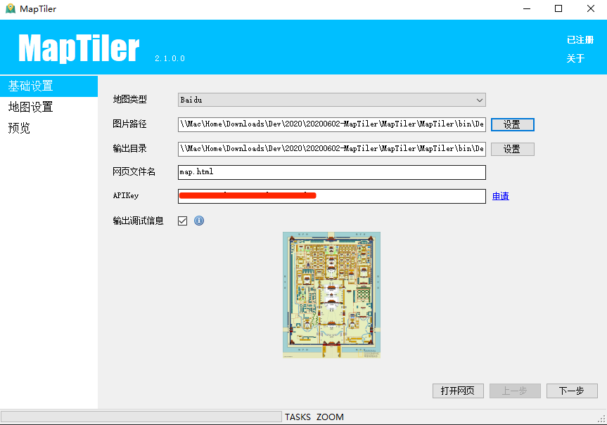
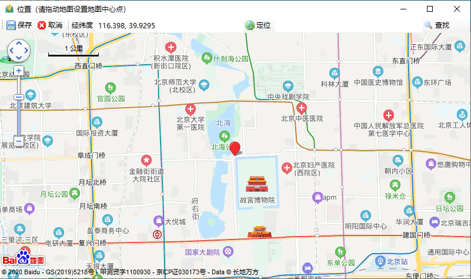
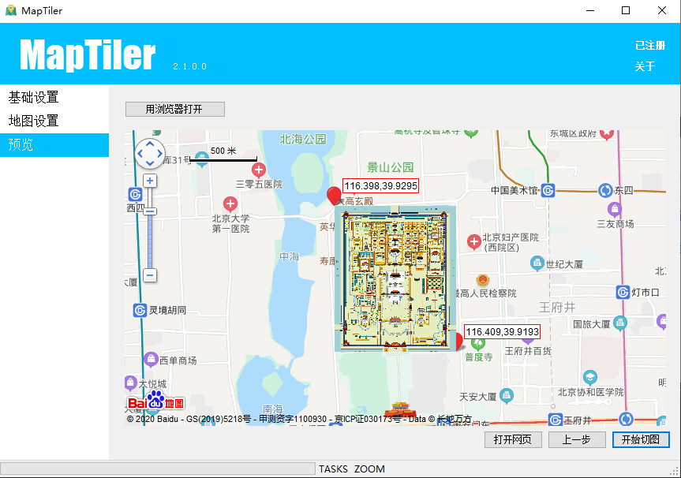
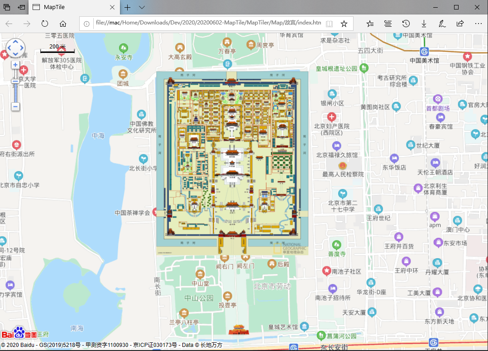
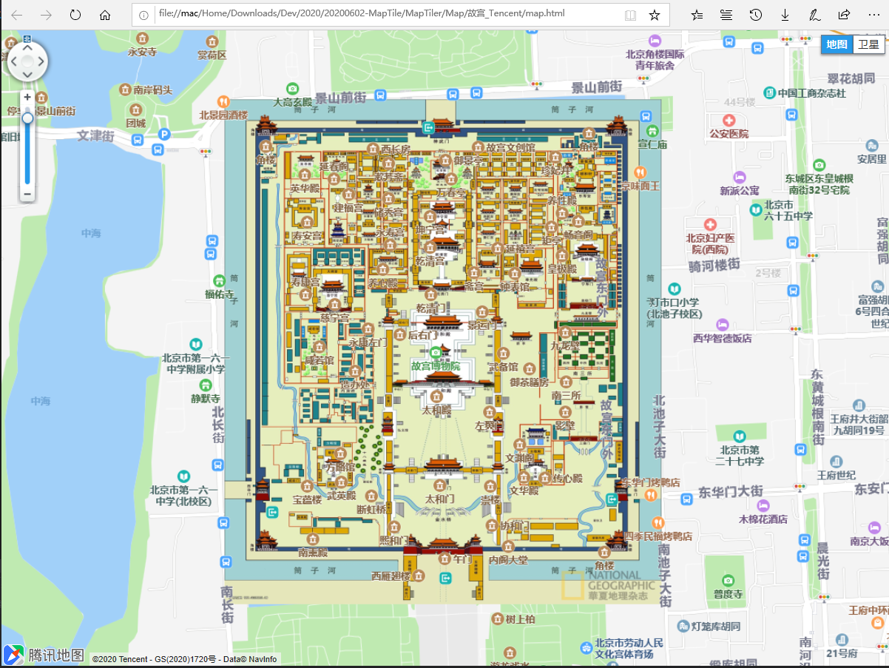
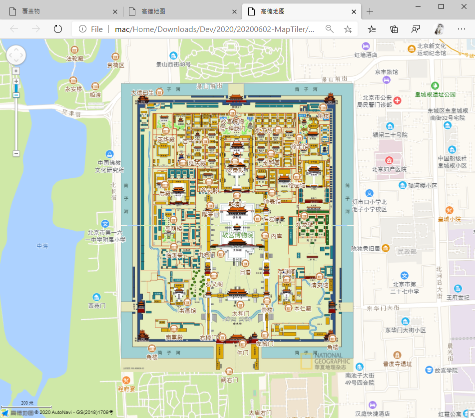
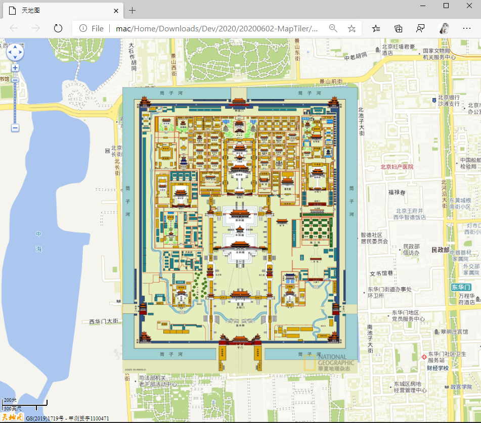
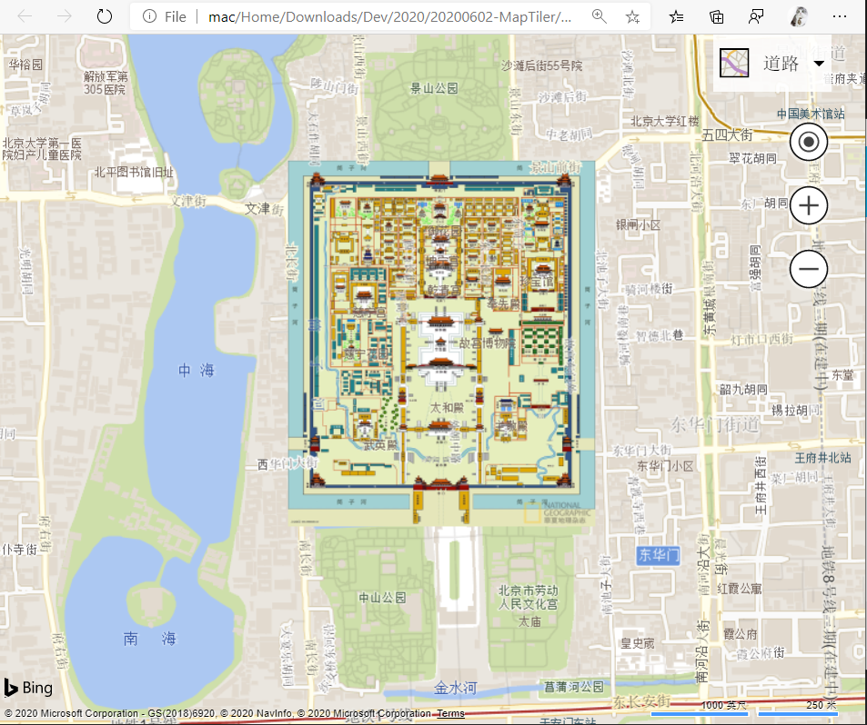
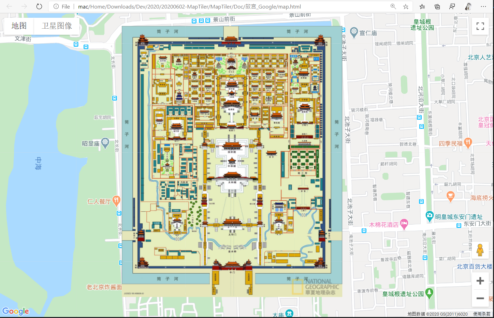

# 1. MapCutter (MapTiler)

地图叠加层瓦片图（金字塔图）创建工具，可用于制作自定义区域地图，如园区地图。支持百度地图、腾讯地图、高德地图等。
Map tile images builder for baidu map, tencent map, google map, ...
Add Custom Map Overlay to map.

https://surfsky.github.io/2020/06/18/MapTiler

https://api.github.com/repos/surfsky/MapTilerRelease/releases/latest

# 2. 支持的地图

- [x] Baidu map
- [x] Tencent map
- [x] Gaode map
- [x] Tiande map
- [x] Bing map
- [x] Google map
- [ ] MapBar map
- [ ] MapBox map
- [ ] LeafLet
- [ ] OpenLayer
- [ ] Supper map

# 3. 操作步骤

（1）基础设置

（2）地图点位设置

（3）预览及截图

# 4. 效果

# 6. Roadmap

- LeafLet
- OpenLayer
- MapBox

# 5. History

3.0.0

     - 嵌入 chrome 浏览器内核，对各地图更适配，速度更快

2.11.2

     - 默认地图改为卫星地图
     - 腾讯地图尝试修复（客户电脑上还是不行）

2.11.0

    - 实现地图目录合并功能。该功能可合并多个地图切片目录，并自动拼接图片，可用于实现超大城市地图的绘制。步骤如下：
    （1）把切好的分块目录（如城区a、城区b、城区c）放到一个主目录下（如城区）；
    （2）点击主界面“合并图片目录”，选择第一步的主目录，点击“处理”按钮；
    （3）等待处理结束，查看合并的目录，如: 城区_merge
     该功能由大图版本提供。

2.10.0
     
     - 简化地图坐标区域设置

2.9.4
   
    - 坐标支持中文字符，不报错
    - 左上角右下角坐标设置反了，会提示不报错。

2.9.3

    - 美化高德地图位置、放缩级别标签
    - 修正小尺寸图退出故障

2.9.2
   
    - 输出地图页面时，显示当前放缩级别和中心点坐标

2.9.1
   
    - 修正大图切图时偶尔出现的BUG： unable to call extract_area extract_area: parameter width not set

2.9.0

    - 切图过程中可取消
    - 修正有些大图会出现竖线的BUG
    - 2021-05-05

2.8.2
    
    - 地图增加卫星模式，便于校对坐标。
    - 修正超大图处理时偶尔出现的bug: 切图中遇到异常，unable to call embed linear. vector must have 1 or 3 elements.
    - 优化图片选择对话框，拆分为: png images, other images, svg files, all files。

2.8.1

    google 地图网页增加参数 minZoom，maxZoom
    修正大图切图，背景色改为（255, 255, 255, 0）

2.8.0

    支持切图级别 22
    优化超大图处理逻辑，性能大大提高
    优化 SVG 图处理逻辑

2.7.2

    修正切图中异常提示的“切图中遇到异常：参数无效”

2.7.1

    支持 SVG 源图片
    切图文件名格式可自定义，默认为 {x}_{y}
    切图前可控是否清空输出目录

2.7.0

    支持超大贴图（大于 20480*20480）
    修改授权模式，可以对单个地图进行授权

2.6.3

    支持19-20级地图切图（分辨率超过 20480*20480），20级切图估计15分钟。
    增加耗时统计
    优化调试输出效果：增加网格，美化文本抗锯齿
    修正位置设置窗口拖动时的 BUG
    2020-08-28

2.6.2

    完善异常捕捉，避免程序崩溃
    显示对应级别的切图信息：图片大小、切图数
    2020-08-12

2.6.1

    支持版本检测
    2020-07-02

2.6.0

    支持 Google Map（需先解决网络问题）
    优化百度地图位置设置窗口，增加label辅助显示
    优化地图类别展示，文本改为中文，增大行距
    2020-07-02

2.5

    支持 Bing Map
    2020-06-30

2.4.2

    优化预览窗口：显示半透明图片(支持百度、腾讯、高德)
    修正地图定位窗口：查找结束后显示中心红点
    2020-06-18

2.4.1

    支持天地图
    2020-06-10

2.4.0
    支持高德地图
    2020-06-08

2.4.0

    支持腾讯地图
    2020-06-04

1.5.0

    支持百度地图
    2020-05-25

# 6. 可发布博文

- Bing 地图居中显示定位点，拖拽始终居中
- Bing 自定义瓦片地图

# 7. 注意

- 此应用依赖 IE，若IE有问题，则地图窗口、预览窗口都无法正常显示。

